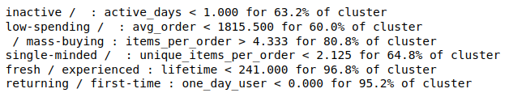

# Clusters Interpretation
(Not translated)

The article describes an algorithm of clusters explanation. Each cluster can be assigned to a set of determined conditions, without references to feature transformations or obscure formulations.
The result is presented on a figure below. Cluster names were assigned using the suggested algorithm.

